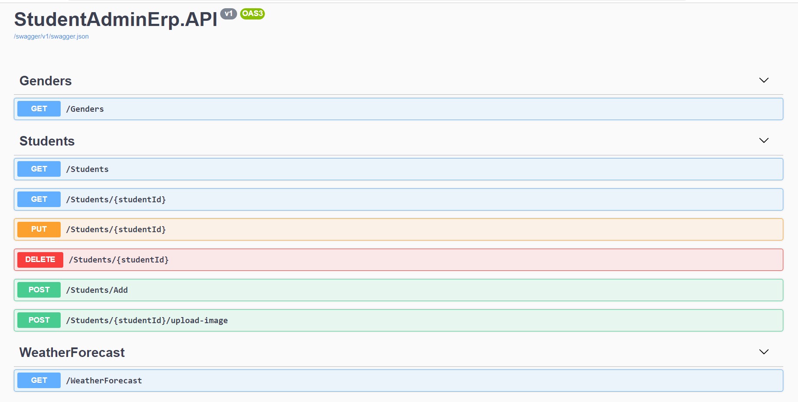
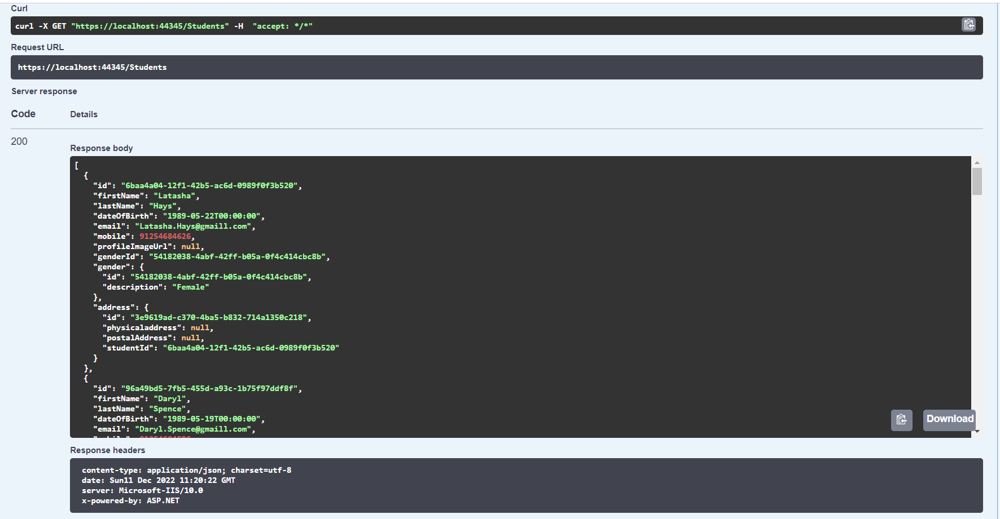
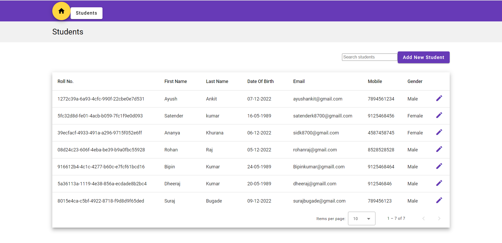
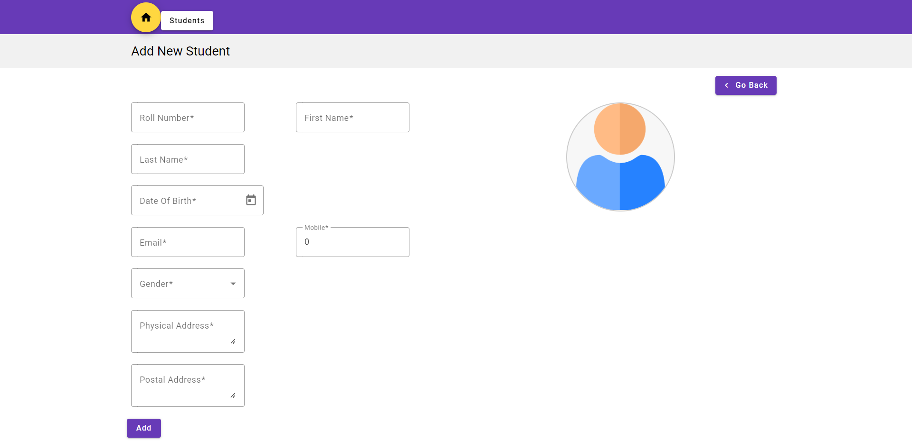

# IntelleWings_StudentAdminErp

Angular-CRUD-with-Asp.Net-Core-Web-API
**Full Stack Angular js CRUD with Asp.Net Core Web

Points discussed :
 
  1. Build Web API in Asp.Net Core with CRUD web methods
  2. React Form Design with Material UI
  3. Implemented CRUD with Redux
  4. Consume API web methods from React
  5. Real-Time Form Validation
  6. etc

# Screenshots

Swagger Api Testing

Swagger GET Fetch

Angular UI Student Table

Add new Student

